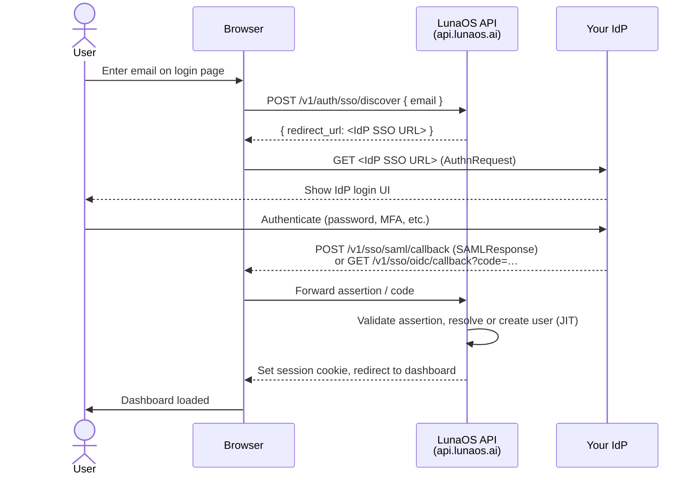

# Enterprise SSO — Admin Guide

## Overview

Enterprise SSO lets your organization authenticate LunaOS users through your own
Identity Provider (IdP). Org admins configure one IdP per organization; LunaOS then
routes login attempts to that IdP automatically based on email-domain discovery.

**Who this is for:** Organization admins on the Team or Enterprise plan.

**What SSO adds:**

- **Per-org IdP binding** — each organization connects its own SAML 2.0 or OIDC IdP.
- **Just-in-time (JIT) user provisioning** — new users are created automatically on
  first login; no manual invitation required.
- **Email-domain discovery** — LunaOS detects the user's domain and redirects to the
  correct IdP without the user selecting one.
- **Fallback login** — if SSO is not configured for an org, users can still log in
  with an API key. Existing API key sessions are not revoked when SSO is enabled.

::: info Supported protocols
LunaOS supports SAML 2.0 (SP-initiated) and OIDC (Authorization Code flow with PKCE).
SAML is the default recommendation for enterprise IdPs such as Okta and Microsoft
Entra ID. OIDC is the preferred choice for Google Workspace.
:::

---

## How it works

The sequence below describes SP-initiated SSO login.

---

## Prerequisites

Before enabling SSO, confirm the following.

**LunaOS side:**

- You hold the **Org Admin** role in your organization.
- Your organization is on the **Team** or **Enterprise** plan.
- You own the email domain(s) you intend to lock to SSO (e.g., `acme.com`).

**IdP side:**

- You have admin access to your IdP.
- Your IdP supports **SAML 2.0** (SP-initiated) or **OIDC** (Authorization Code).
- For SAML: your IdP can export a metadata XML or individual certificate + URLs.
- For OIDC: your IdP supports a discovery endpoint
  (`/.well-known/openid-configuration`).

---

## Enabling SSO

1. In the LunaOS dashboard, navigate to **Organization Settings → SSO**.
2. Click **New SSO Configuration**.
3. Select your protocol: **SAML 2.0** or **OIDC**.
4. Follow the provider-specific setup guide:
   - [Okta (SAML)](./okta-saml.md)
   - [Microsoft Entra ID / Azure AD (SAML)](./azure-ad-saml.md)
   - [Google Workspace (OIDC)](./google-oidc.md)
5. After saving, enter a test email from your domain and click **Test SSO**.
   A passing test confirms the IdP round-trip works before you enforce login.
6. Set **Enforce SSO** to **On** to require all users on the configured email domain
   to authenticate via the IdP.

::: warning Test before enforcing
Always run the SSO test in step 5 before toggling Enforce SSO. If enforcement is
enabled while SSO is misconfigured, users on your domain will be unable to log in.
Your org admin API key remains valid as a recovery path.
:::

---

## Managing JIT-provisioned users

When a user logs in via SSO for the first time, LunaOS creates their account
automatically using the `email`, `firstName`, and `lastName` attributes from the
IdP assertion.

**Default role assignment:**

JIT-provisioned users receive the role set in your SSO configuration field
`defaultRole`. Allowed values: `member`, `viewer`. Org admins are never provisioned
automatically; grant the admin role manually after the user's first login.

**Identifying JIT-provisioned users:**

In **Organization Settings → Members**, JIT-provisioned accounts show the badge
**SSO** next to their name. You can filter by this badge to review the list.

**Changing a user's role:**

1. Go to **Organization Settings → Members**.
2. Find the user and click **Edit**.
3. Update the **Role** field and save.

**Removing access:**

There are two ways to revoke a user's access:

| Method | Effect |
|--------|--------|
| Disable the user in your IdP | Blocks future logins. Active LunaOS sessions expire at their natural TTL (24 h). |
| Remove the user in LunaOS dashboard | Immediately removes org membership. The user cannot log in even if the IdP account is active. |

For immediate revocation, use both methods together.

---

## Disabling SSO

1. Go to **Organization Settings → SSO**.
2. Toggle **Enabled** to **Off** and confirm.

Existing SSO sessions remain valid until their TTL expires (24 hours); they are not
forcibly terminated. Users who log in after SSO is disabled will see the standard
login form and can authenticate with an API key or password-reset email.

API key authentication is always available, independent of SSO state.

---

## Security best practices

**Certificate rotation (SAML):**

Rotate your IdP's signing certificate every 365 days. When a new certificate is
issued:

1. Upload the new certificate to your LunaOS SSO configuration.
2. LunaOS supports two active certificates simultaneously during the rotation window.
3. Remove the old certificate after confirming all assertions are signed with the new one.

**Secret rotation (OIDC):**

Rotate your OAuth client secret at least annually, or immediately after any
suspected exposure:

1. Generate a new secret in your IdP.
2. Update the **Client Secret** field in **Organization Settings → SSO**.
3. Save and run the SSO test to confirm the new secret works before revoking the old one.

**Email domain restriction:**

Set `emailDomain` to a domain you own and control. Avoid wildcards. If your org
uses multiple domains (e.g., `acme.com` and `acme.co.uk`), create a separate SSO
configuration for each domain.

**Audit log monitoring** — monitor these events in **Organization Settings → Audit Log**
or via webhook:

| Event | Meaning |
|-------|---------|
| `sso.idp.login_success` | User authenticated successfully via IdP |
| `sso.idp.login_failure` | IdP assertion rejected (see error code in payload) |
| `sso.idp.jit_provision` | New user created by JIT provisioning |
| `sso.config.created` | SSO configuration added |
| `sso.config.updated` | SSO configuration changed |
| `sso.config.deleted` | SSO configuration removed |
| `sso.enforce.enabled` | SSO enforcement turned on |
| `sso.enforce.disabled` | SSO enforcement turned off |

**Client secret handling (OIDC):** Never share the OIDC client secret with end users
or embed it in client-side code. LunaOS stores it encrypted at rest and never returns
it in full via the API after initial save.

---

## Troubleshooting

If users cannot log in or you see SSO error codes, see the
[SSO Troubleshooting Guide](./troubleshooting.md).
